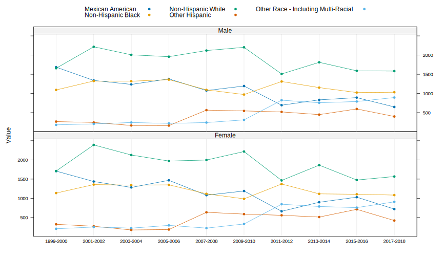

## Introduction

One of the goals of the Epiconductor project is to make the analysis
of NHANES data simpler. To this end, it provides tools that can be
used to (a) download all public NHANES data and and load it into an
SQL database, and (b) make snapshots of this database available
locally through docker images. The primary goal in distributing the
pre-built docker images is to provide a ready-to-use tool for data
analysts who may not be conversant with database technologies. The
docker image thus includes R and RStudio, along with a version of the
`nhanesA` R package that is configured to obtain data from the SQL
database rather than the CDC website. We expect most users of the
docker image to use it through the `nhanesA` package. Such analyses
will run even outside the docker environment as well, albeit more
slowly as it will involve downloading data from the CDC website.

The potential uses of the docker image goes beyond this, however. As
NHANES collects and publishes data on a continuous basis, it is
natural to want to combine data across cycles. This is not
straightforward because a certain variable of interest may be present
in different tables in different cyles, or may not even be present in
all cycles. With all data locally available, it is possible to
efficiently check where variables are to be found (if at all), examine
differences over NHANES cycles, and detect a range of anomalies that
any analyst needs to be aware of, but would normally be difficult to
find. This vignette provides some illustrative examples, and describes
some relevant tools in the `phonto` package that could be useful to
practitioners.


- Combining data across cycles

- Consistency checks:

	- Across cycles: change in units

	- Within cycles: Variables appearing in multiple tables

- Variables that are potentially skipped


## Combining data across cycles


We start with a straightforward illustration of the process of
combining data across cycles, where we combine the demographic data
table from all cycles. NHANES table names typically have a suffix; the
suffixes `_A`, `_B`, `_C`,and so on generally correspond to NHANES
cycle years from 1999-2000, 2001-2002, 2003-2004, etc. However, it is
important to highlight that not every table strictly adheres to this
naming convention. For instance, while `DEMO_B` and `DEMO_C` are
associated with the 2001-2002 and 2003-2004 cycles, respectively, the
corresponding table for the 1999-2000 cycle is named 'DEMO', without
the `_A` suffix. While this pattern holds for most tables, certain
tables such as `SSAFB_A` and `SSANA_A` from the 1999-2000 cycle do
include the `_A` suffix. To assist users in navigating these
variations, the `nhanesA` package includes the
`nhanesSearchTableNames()` function, which allows users to easily
locate all table names containing a specific string, thus simplifying
the process of identifying relevant table names.


```r
library(nhanesA)
demo_all <- nhanesSearchTableNames("DEMO")
demo_all
```

```
 [1] "DEMO"   "DEMO_B" "DEMO_C" "DEMO_D" "DEMO_E" "DEMO_F" "DEMO_G" "DEMO_H"
 [9] "DEMO_I" "DEMO_J" "P_DEMO"
```

The last table in this list merits special mention. During the
2019-2020 cycle, data collection was disrupted by the COVID-19
pandemic. Therefore, the partial 2019-2020 data (herein 2019-March
2020 data) were combined with data from the previous cycle (2017-2018)
to create a nationally representative sample covering 2017-March 2020.
These data files have the same basic file name, e.g., `DEMO`, but add
the prefix `P_`. These 'pre-pandemic' files require special handling
and the CDC has provided substantial guidance as well as updated
survey weights.

We can now collect all these datasets using `nhanes()`
function. Normally, this process is likely to be somewhat slow as
several files will need to be downloaded from the CDC website. Within
the docker environment, however, it should be almost instantaneous.


```r
all_demo_data <- sapply(demo_all, nhanes, simplify = FALSE)
object.size(all_demo_data) # ~45 MB
```

```
47137304 bytes
```

```r
sapply(all_demo_data, dim)
```

```
     DEMO DEMO_B DEMO_C DEMO_D DEMO_E DEMO_F DEMO_G DEMO_H DEMO_I DEMO_J P_DEMO
[1,] 9965  11039  10122  10348  10149  10537   9756  10175   9971   9254  15560
[2,]  145     37     44     43     43     43     48     47     47     46     29
```

The first row in the output above gives the number of participants in
each cycle, and the second row denotes the number of variables in the
corresponding `DEMO` table. We can see that each cycle has around
10,000 participants, who are unique across cycles. Note, however, that
the larger number of participants in the `P_DEMO` dataset is
misleading, because many of these participants are actually from the
previous cycle as described above. We will drop this table before
combining the remaining datasets.

The differing number of variables across cycles indicate that
variables are not measured consistently across cycles. In fact, many
variables included in the `DEMO` table in the first cycle were
subsequently included in other tables, and others have been dropped
altogether or added. We can make a list of the variables that are
common to all `DEMO` tables, and combine the corresponding data
subsets together, as follows.


```r
all_demo_data <- head(all_demo_data, -1)
common_vars <- lapply(all_demo_data, names) |> Reduce(f = intersect)
common_vars
```

```
 [1] "SEQN"     "SDDSRVYR" "RIDSTATR" "RIDEXMON" "RIAGENDR" "RIDRETH1"
 [7] "DMDCITZN" "DMDYRSUS" "DMDEDUC3" "DMDEDUC2" "DMDMARTL" "RIDEXPRG"
[13] "DMDHRGND" "RIDAGEYR" "RIDAGEMN" "DMDHHSIZ" "INDFMPIR" "WTINT2YR"
[19] "WTMEC2YR" "SDMVPSU"  "SDMVSTRA"
```

```r
demo_combined <-
    lapply(all_demo_data, `[`, common_vars) |>
    do.call(what = rbind) |>
    transform(cycle = substring(SDDSRVYR, 8, 17))
dim(demo_combined)
```

```
[1] 101316     22
```

The combined dataset can be analysed further using standard tools. For
example, the following code uses the `lattice` package to summarize
the number of participants by recorded ethnicity and gender by cycle.


```r
library("lattice")
demo_combined |>
    xtabs(~ cycle + RIAGENDR + RIDRETH1, data = _) |>
    array2DF() |>
    dotplot(Value ~ cycle | RIAGENDR,
            groups = RIDRETH1,
            layout = c(1, 2), type = "b",
            par.settings = simpleTheme(pch = 16),
            auto.key = list(columns = 3))
```

<div class="figure">

<p class="caption">plot of chunk demoplot</p>
</div>


One must be cautious when combining data across
cycles, because the NHANES data are sometimes inconsistent in
unexpected ways. As a simple example, consider the `DMDEDUC3`
variable, which records education level of children and youth. The
following code illustrates that the values of this variable have
inconsistent capitalization in different cycles.


```r
xtabs(~ cycle + DMDEDUC3, demo_combined)[, 1:4]
```

```
            DMDEDUC3
cycle        10th grade 10th Grade 11th grade 11th Grade
  1999-2000           0        307          0        281
  2001-2002           0        324          0        319
  2003-2004           0        284          0        295
  2005-2006           0        307          0        277
  2007-2008           0        154          0        165
  2009-2010           0        193          0        185
  2011-2012         167          0        150          0
  2013-2014         162          0        186          0
  2015-2016         160          0        153          0
  2017-2018         139          0        155          0
```


## Cross-cycle Consistency checks using variable codebooks

In our experience, inconsistencies such as the change in
capitalization described above occur quite often, and in a variety of
different ways, requiring attention to detail when combining data from
across cycles. These inconsistencies are not necessarily mistakes, as
NHANES questionnaires and variables are often modified from cycle to
cycle. The primary source that must be consulted to identify such
inconsistencies are the per-table documentation, and in particular the
variable codebooks giving details of how each variable is recorded.

The NHANES database contains the variable codebooks for all tables
across all cycles in a single database table called
`Metadata.VariableCodebook`. Once imported into R, this information
can be manipulated in various ways to glean information of
interest. See the [codebook
diagnostics](https://ccb-hms.github.io/phonto/vignettes/diagnostics-codebook.html)
vignette for a different set of diagnostics that are enabled by having
easy access to this information.


```r
library("phonto")
dim(all_cb <- nhanesQuery("select * from Metadata.VariableCodebook"))
```

```
[1] 202018      7
```

```r
## dim(all_cb <- metaData("Codebook")) # alt interface
all_cb <- dplyr::filter(all_cb, !startsWith(TableName, "P_")) # skip pre-pandemic tables
```

An analyst would typically be interested in some specific variables
that are relevant to their study. The first step is to identify how
many cycles these variables were recorded in.  To this end, we may
start by examining the number of _tables_ each variable appears in
across all cycles of continuous NHANES.


```r
var_freq <- 
    all_cb[c("Variable", "TableName")] |> unique() |>
        xtabs(~ Variable, data = _) |>
        sort(decreasing = TRUE)
table(var_freq)
```

```
var_freq
   1    2    3    4    5    6    7    8    9   10   11   12   13   14   15   16 
4720 3861 2358  564  373  696  776  529  266  365   49   46  263   50   11   23 
  17   18   19   20   21   22   23   25   28   29   30   32   40   56   58   66 
   2   33    3   48    1    4    1    3    8    1    1    2    1    1    1    1 
  74  111 
   1    1 
```

Not surprisingly, many variables appear only once or twice across all
cycles, and for such variables combining data across cycles would not
be interesting. Variables that appear in multiple cycles, but only
once per cycle, may usually be merged as in the `DEMO` example above,
but note that they may appear in different tables. One must be careful
about ensuring that the variable is measuring the same quantity in all
cycles. This is usually true, but not always. For example, the range
of values for the `LBCBHC` variable in different cycles seem to
exhibit some discrepancy.


```r
subset(all_cb, Variable == "LBCBHC")[1:5]
```

```
       Variable TableName      CodeOrValue ValueDescription Count
150088   LBCBHC  PSTPOL_D  0.004 to 2.3147  Range of Values   247
150089   LBCBHC  PSTPOL_D                .          Missing     0
150168   LBCBHC  PSTPOL_E 0.0044 to 5.2617  Range of Values   264
150169   LBCBHC  PSTPOL_E                .          Missing     0
150249   LBCBHC  PSTPOL_F    3.465 to 4801  Range of Values   295
150250   LBCBHC  PSTPOL_F                .          Missing     6
150324   LBCBHC  PSTPOL_G    3.536 to 5401  Range of Values   251
150325   LBCBHC  PSTPOL_G                .          Missing     0
150399   LBCBHC  PSTPOL_H    3.536 to 5648  Range of Values   281
150400   LBCBHC  PSTPOL_H                .          Missing     3
150467   LBCBHC  PSTPOL_I    3.536 to 1330  Range of Values   265
150468   LBCBHC  PSTPOL_I                .          Missing     0
```

More useful information about the variables may be obtained from the
`Metadata.QuestionnaireVariables` table in the database, which
contains one row for each variable in each table containing its
description, target group, etc., obtained from the HTML documentation
of NHANES tables.


```r
dim(all_var <- phonto::nhanesQuery("select * from Metadata.QuestionnaireVariables"))
```

```
[1] 50714    11
```

```r
## dim(all_var <- metaData("Variables"))
subset(all_var, Variable == "LBCBHC")[1:5]
```

```
      Variable TableName                       Description
43244   LBCBHC  PSTPOL_D Beta-hexachlorocyclohexane (ng/g)
43277   LBCBHC  PSTPOL_E Beta-hexachlorocyclohexane (ng/g)
43310   LBCBHC  PSTPOL_F Beta-hexachlorocyclohexane (pg/g)
43340   LBCBHC  PSTPOL_G Beta-hexachlorocyclohexane (pg/g)
43370   LBCBHC  PSTPOL_H Beta-hexachlorocyclohexane (pg/g)
43397   LBCBHC  PSTPOL_I Beta-hexachlorocyclohexane (pg/g)
                                           Target
43244 Both males and females 12 YEARS - 150 YEARS
43277 Both males and females 12 YEARS - 150 YEARS
43310 Both males and females 12 YEARS - 150 YEARS
43340 Both males and females 12 YEARS - 150 YEARS
43370 Both males and females 12 YEARS - 150 YEARS
43397 Both males and females 12 YEARS - 150 YEARS
                               SasLabel
43244 Beta-hexachlorocyclohexane (ng/g)
43277 Beta-hexachlorocyclohexane (ng/g)
43310 Beta-hexachlorocyclohexane (pg/g)
43340 Beta-hexachlorocyclohexane (pg/g)
43370 Beta-hexachlorocyclohexane (pg/g)
43397 Beta-hexachlorocyclohexane (pg/g)
```

This shows that the unit of measurement was changed from the
2009--2010 cycle, explaining the discrepancy. Without a careful check,
such changes may be overlooked, leading to errors in interpretation.

It is not easy to systematically detect such changes without manual
inspection of variables of interest. One way to shortlist possible
candidate variables are to identify those for whom the `Description`
or `SasLabel` field has changed. Unfortunately, such changes happen
frequently for completely benign reasons, leading to many false
positives.


## Within-cycle consistency

Somewhat more surprisingly, several variables appear
in more tables than there are cycles, which means that they must
appear in multiple tables within the same cycle. The following
variables appear in more than 20 tables.


```r
var_freq[ var_freq > 20 ]
```

```
Variable
  URXUCR  WTSA2YR   WTDRD1   DRDINT   WTDR2D RIAGENDR    DRABF  WTSB2YR 
     111       74       66       58       56       40       32       32 
 WTSC2YR WTSAF2YR   DR1DAY DR1DRSTZ DR1EXMER  DR1LANG   DR2DAY DR2DRSTZ 
      30       29       28       28       28       28       28       28 
DR2EXMER  DR2LANG  RIANSMP RIDAGGRP    WTFSM WTSVOC2Y  DR1DBIH  DR2DBIH 
      28       28       25       25       25       23       22       22 
PHAFSTHR PHAFSTMN  DSDSUPP 
      22       22       21 
```

For such variables, selecting the corresponding subset of `all_cb`
shows all entries in the codebook tables for that variable, across all
tables and cycles. For example,


```r
subset(all_cb, Variable == "PHAFSTMN")[1:5]
```

```
       Variable TableName CodeOrValue ValueDescription Count
74503  PHAFSTMN  FASTQX_D     0 to 59  Range of Values  8903
74504  PHAFSTMN  FASTQX_D           .          Missing   537
74546  PHAFSTMN  FASTQX_E     0 to 59  Range of Values  8832
74547  PHAFSTMN  FASTQX_E           .          Missing   475
74589  PHAFSTMN  FASTQX_F     0 to 59  Range of Values  9557
74590  PHAFSTMN  FASTQX_F           .          Missing   278
74632  PHAFSTMN  FASTQX_G     0 to 59  Range of Values  8528
74633  PHAFSTMN  FASTQX_G           .          Missing   428
74675  PHAFSTMN  FASTQX_H     0 to 59  Range of Values  9182
74676  PHAFSTMN  FASTQX_H           .          Missing   240
74718  PHAFSTMN  FASTQX_I     0 to 59  Range of Values  8911
74719  PHAFSTMN  FASTQX_I           .          Missing   254
74761  PHAFSTMN  FASTQX_J     0 to 59  Range of Values  7996
74762  PHAFSTMN  FASTQX_J           .          Missing   370
84545  PHAFSTMN     GLU_D     0 to 59  Range of Values  3251
84546  PHAFSTMN     GLU_D           .          Missing   101
84559  PHAFSTMN     GLU_E     0 to 59  Range of Values  3223
84560  PHAFSTMN     GLU_E           .          Missing    92
84573  PHAFSTMN     GLU_F     0 to 59  Range of Values  3535
84574  PHAFSTMN     GLU_F           .          Missing    46
84587  PHAFSTMN     GLU_G     0 to 59  Range of Values  3167
84588  PHAFSTMN     GLU_G           .          Missing    72
84598  PHAFSTMN     GLU_H     0 to 59  Range of Values  3291
84599  PHAFSTMN     GLU_H           .          Missing    38
92762  PHAFSTMN     INS_H     0 to 59  Range of Values  3291
92763  PHAFSTMN     INS_H           .          Missing    38
92776  PHAFSTMN     INS_I     0 to 59  Range of Values  3135
92777  PHAFSTMN     INS_I           .          Missing    56
110377 PHAFSTMN    OGTT_D     0 to 59  Range of Values  3251
110378 PHAFSTMN    OGTT_D           .          Missing   101
110395 PHAFSTMN    OGTT_E     0 to 59  Range of Values  3223
110396 PHAFSTMN    OGTT_E           .          Missing    92
110430 PHAFSTMN    OGTT_F     0 to 59  Range of Values  3163
110431 PHAFSTMN    OGTT_F           .          Missing     0
110465 PHAFSTMN    OGTT_G     0 to 59  Range of Values  2815
110466 PHAFSTMN    OGTT_G           .          Missing     0
110505 PHAFSTMN    OGTT_H     0 to 59  Range of Values  2909
110506 PHAFSTMN    OGTT_H           .          Missing     0
148145 PHAFSTMN        PH     0 to 59  Range of Values  8350
148146 PHAFSTMN        PH           .          Missing   482
148188 PHAFSTMN      PH_B     0 to 59  Range of Values  9480
148189 PHAFSTMN      PH_B           .          Missing   449
148231 PHAFSTMN      PH_C     0 to 59  Range of Values  9013
148232 PHAFSTMN      PH_C           .          Missing   166
```


Inspection of this table shows that the `PHAFSTMN` variable was
initially recorded in the `PH` table for the first three cycles, after
which it was recorded in three different tables (`FASTQX`, `GLU`, and
`OGTT`) for several cycles, before being dropped again from the latter
two tables. It is natural to wonder whether all these tables contain
the same data. This can only be verified by comparing the actual data,
which we will not do for this example, but some hints are provided by
the data counts included in the codebook. For example, for the
2005--2006 cycle, we have


```r
subset(all_cb, Variable == "PHAFSTMN" & endsWith(TableName, "_D"))[1:5]
```

```
       Variable TableName CodeOrValue ValueDescription Count
74503  PHAFSTMN  FASTQX_D     0 to 59  Range of Values  8903
74504  PHAFSTMN  FASTQX_D           .          Missing   537
84545  PHAFSTMN     GLU_D     0 to 59  Range of Values  3251
84546  PHAFSTMN     GLU_D           .          Missing   101
110377 PHAFSTMN    OGTT_D     0 to 59  Range of Values  3251
110378 PHAFSTMN    OGTT_D           .          Missing   101
```

From the variable metadata table, we see that 


```r
subset(all_var, Variable == "PHAFSTMN" & endsWith(TableName, "_D"))[c(1, 2, 4, 5)]
```

```
      Variable TableName                                      Target
24274 PHAFSTMN  FASTQX_D  Both males and females 1 YEARS - 150 YEARS
25529 PHAFSTMN     GLU_D Both males and females 12 YEARS - 150 YEARS
31383 PHAFSTMN    OGTT_D Both males and females 12 YEARS - 150 YEARS
                                 SasLabel
24274   Total length of food fast minutes
25529 Total length of 'food fast' minutes
31383 Total length of 'food fast' minutes
```

While not definitive, this suggests that the `PHAFSTMN` variable
measures the same quantity in all three tables, and the difference in
number of observations may be due to the difference in target age
group.

Even if a preliminary inspection suggests no obvious problems, one
should verify by comparing the actual recorded data. For example,
consider the `ENQ100` variable, which appears in both `ENX` and `SPX`
tables.


```r
subset(all_var, Variable == "ENQ100" & endsWith(TableName, "_E"))[c(1, 2, 4, 5)]
```

```
      Variable TableName                                    Target
23932   ENQ100     ENX_E Both males and females 6 YEARS - 79 YEARS
45401   ENQ100     SPX_E Both males and females 6 YEARS - 79 YEARS
                             SasLabel
23932 Cough cold resp illness 7 days?
45401        Had respiratory illness?
```

```r
merge(nhanes("ENX_E")[c("SEQN", "ENQ100")],
      nhanes("SPX_E")[c("SEQN", "ENQ100")], by = "SEQN") |>
    xtabs(~ ENQ100.x + ENQ100.y, data =_, addNA = TRUE)
```

```
            ENQ100.y
ENQ100.x     Don't know   No  Yes <NA>
  Don't know          3    0    0    0
  No                  0 5013    0    0
  Yes                 0    0 1354    0
  <NA>                0  217   63 1093
```

Comparing the records in the two tables after matching by `SEQN`, the
participant identifier, we see that even though most records are
consistent, several records with `Yes` or `No` answers in the `SPX`
tables are recorded as `NA` (missing) in the `ENX` tables.


A more egregious example, where the same variable is clearly measuring
two different things, is provided by the `LBXHCT` variable.


```r
subset(all_cb, Variable == "LBXHCT" & endsWith(TableName, "_H"))[1:5]
```

```
      Variable TableName   CodeOrValue ValueDescription Count
24512   LBXHCT     CBC_H  17.9 to 56.5  Range of Values  8544
24513   LBXHCT     CBC_H             .          Missing   878
33809   LBXHCT     COT_H 0.011 to 1150  Range of Values  8029
33810   LBXHCT     COT_H             .          Missing   884
```

```r
subset(all_var, Variable == "LBXHCT" & endsWith(TableName, "_H"))[c(1, 2, 3, 4, 5)]
```

```
      Variable TableName                   Description
9538    LBXHCT     CBC_H                Hematocrit (%)
11531   LBXHCT     COT_H Hydroxycotinine Serum (ng/mL)
                                          Target                      SasLabel
9538  Both males and females 1 YEARS - 150 YEARS                Hematocrit (%)
11531 Both males and females 3 YEARS - 150 YEARS Hydroxycotinine Serum (ng/mL)
```

```r
merge(nhanes("CBC_H")[c("SEQN", "LBXHCT")],
      nhanes("COT_H")[c("SEQN", "LBXHCT")], by = "SEQN") |> head()
```

```
   SEQN LBXHCT.x LBXHCT.y
1 73557     45.4    1.330
2 73558     36.7    4.480
3 73559     49.9    0.055
4 73560     37.8    0.025
5 73561     43.8    0.011
6 73562     41.5    0.011
```


## Quality control reports

Getting a comprehensive picture of the issues relevant for a
particular variable may take some work, as seen in the above
examples. However, much of the preliminary work can be automated, and
the `qc_var()` function in the `phonto` package dowa precisely this.

The report for the `LBCBHC` variable can be generated using the
following call.


```r
qc_var("LBCBHC")
```

```
Variable:  LBCBHC
Mismatch in Description:
                        description Frequency
1 Beta-hexachlorocyclohexane (ng/g)         2
2 Beta-hexachlorocyclohexane (pg/g)         4

Mismatch in Saslabel:
                           saslabel Frequency
1 Beta-hexachlorocyclohexane (ng/g)         2
2 Beta-hexachlorocyclohexane (pg/g)         4
```

Similarly, the reports for `PHAFSTMN` (where the issues flagged are
relatively benign) and `LBXHCT` (where they are not) are obtained as
follows.


```r
qc_var("PHAFSTMN")
```

```
Variable:  PHAFSTMN
Appears in multiple tables within same cycle:
       cycle                            Tables
1  1999-2000                                PH
2  2001-2002                              PH_B
3  2003-2004                              PH_C
4  2005-2006         FASTQX_D / GLU_D / OGTT_D
5  2007-2008         FASTQX_E / GLU_E / OGTT_E
6  2009-2010         FASTQX_F / GLU_F / OGTT_F
7  2011-2012         FASTQX_G / GLU_G / OGTT_G
8  2013-2014 FASTQX_H / GLU_H / INS_H / OGTT_H
9  2015-2016                  FASTQX_I / INS_I
10 2017-2018                          FASTQX_J
11 2017-2020                          P_FASTQX

Mismatch in Description:
                                                                                                                     description
1 The time (in minutes) between when the examinee last ate or  drank anything other than water and the time of the venipuncture.
2  The time (in minutes) between when the examinee last ate or drank anything other than water and the time of the venipuncture.
3                                                                                            Total length of 'food fast' minutes
  Frequency
1         1
2        12
3        10

Mismatch in Saslabel:
                             saslabel Frequency
1 Total length of 'food fast' minutes        12
2   Total length of food fast minutes        11

Mismatch in Target:
                                       target Frequency
1  Both males and females 1 YEARS - 150 YEARS        11
2 Both males and females 12 YEARS - 150 YEARS        12
```

```r
qc_var("LBXHCT")
```

```
Variable:  LBXHCT
Appears in multiple tables within same cycle:
       cycle        Tables
1  1999-2000         LAB25
2  2001-2002         L25_B
3  2003-2004         L25_C
4  2005-2006         CBC_D
5  2007-2008         CBC_E
6  2009-2010         CBC_F
7  2011-2012         CBC_G
8  2013-2014 CBC_H / COT_H
9  2015-2016 CBC_I / COT_I
10 2017-2018 CBC_J / COT_J
11 2017-2020         P_CBC

Mismatch in Description:
                    description Frequency
1                Hematocrit (%)        11
2 Hydroxycotinine Serum (ng/mL)         3

Mismatch in Saslabel:
                       saslabel Frequency
1                Hematocrit (%)        11
2 Hydroxycotinine Serum (ng/mL)         3

Mismatch in Target:
                                      target Frequency
1 Both males and females 1 YEARS - 150 YEARS        11
2 Both males and females 3 YEARS - 150 YEARS         3
```

As we can see, these reports give an incomplete but suggestive initial
list of potential issues, which can be followed up on by the analyst
if necessary.

Other useful checks that have not yet been implemented but are planned
include:

* Special codes in numeric variables: For numeric variables, special
  codes are sometimes used to indicate unusual values. A common use is
  to have special codes to disambiguate various types of missing
  responses (e.g., `"Refused"` and `"Don't know"`). Some of these are
  already converted to `NA` values by default, but others may remain.

* One particular instance of special codes represent data coarsening,
  that is, clubbing of numeric values over a range (e.g., ages over 80
  are usually replaced by 80).

The plan is to report the presence of such codes in variable QC
reports.

## Variables that are potentially skipped

Some variables in a table may be skipped depending on the response to
a previous question. This information is recorded in the variable
codebooks. For example, in table `WHQ`, if the response to `WHD060` is
"Yes", then subsequent questions are skipped until `WHQ090` is
reached.


```r
nhanesCodebook("WHQ", "WHD060")
```

```
$WHD060
$WHD060$`Variable Name:`
[1] "WHD060"

$WHD060$`SAS Label:`
[1] "Weight change intentional"

$WHD060$`English Text:`
[1] "Was the change between {your/SP's} current weight and {your/his/her} weight a year ago intentional?"

$WHD060$`Target:`
[1] "Both males and females 16 YEARS - 150 YEARS"

$WHD060$WHD060
  Code.or.Value Value.Description Count Cumulative Skip.to.Item
1             1               Yes   508        508       WHQ090
2             2                No   376        884         <NA>
3             7           Refused     0        884         <NA>
4             9        Don't know     0        884         <NA>
5             .           Missing  5160       6044         <NA>
```

This information, while useful, does not directly tell us _which_
variables were skipped. This may be important for the analyst to know,
because a variable that was skipped is recorded as a missing value,
whereas we may actually have additional information based on whether
it was skipped or not. In the above example, the immediately following
variable is `WHQ070`.


```r
nhanesCodebook("WHQ", "WHQ070")
```

```
$WHQ070
$WHQ070$`Variable Name:`
[1] "WHQ070"

$WHQ070$`SAS Label:`
[1] "Tried to lose weight in past year"

$WHQ070$`English Text:`
[1] "During the past 12 months {have you/has SP} tried to lose weight?"

$WHQ070$`Target:`
[1] "Both males and females 16 YEARS - 150 YEARS"

$WHQ070$WHQ070
  Code.or.Value Value.Description Count Cumulative Skip.to.Item
1             1               Yes  1618       1618         <NA>
2             2                No  3889       5507       WHQ090
3             7           Refused     8       5515       WHQ090
4             9        Don't know    11       5526       WHQ090
5             .           Missing   518       6044         <NA>
```

This codebook gives no indication of whether this question could have
been skipped for some participants. However, from the previous
codebook, was can infer that out of the 518 missing values, 508 were
presumably from those that said "Yes" to `WHD060`, and these are
qualitatively different from the remaining 10. While the question of
_how_ to address such situations is for the analyst to answer, it
would be useful to flag variables that are potentially skipped.

The `get_skip_info()` function in the `phonto` package reports the
variables that are potentially skipped in any given table. The
following code applies it on the `WHQ` table.


```r
get_skip_info("WHQ")
```

```
   Table Variable MaybeSkipped                SkippedDueTo
1    WHQ   WHD010        FALSE                            
2    WHQ   WHD020        FALSE                            
3    WHQ   WHQ030        FALSE                            
4    WHQ   WHD040        FALSE                            
5    WHQ   WHD050        FALSE                            
6    WHQ   WHD060        FALSE                            
7    WHQ   WHQ070         TRUE                      WHD060
8    WHQ  WHD080A         TRUE WHD060,WHQ070,WHQ070,WHQ070
9    WHQ  WHD080B         TRUE WHD060,WHQ070,WHQ070,WHQ070
10   WHQ  WHQ080C         TRUE WHD060,WHQ070,WHQ070,WHQ070
11   WHQ  WHD080D         TRUE WHD060,WHQ070,WHQ070,WHQ070
12   WHQ  WHQ080E         TRUE WHD060,WHQ070,WHQ070,WHQ070
13   WHQ  WHD080F         TRUE WHD060,WHQ070,WHQ070,WHQ070
14   WHQ  WHQ080G         TRUE WHD060,WHQ070,WHQ070,WHQ070
15   WHQ  WHQ080H         TRUE WHD060,WHQ070,WHQ070,WHQ070
16   WHQ  WHQ080I         TRUE WHD060,WHQ070,WHQ070,WHQ070
17   WHQ  WHQ080J         TRUE WHD060,WHQ070,WHQ070,WHQ070
18   WHQ  WHQ080K         TRUE WHD060,WHQ070,WHQ070,WHQ070
19   WHQ  WHD080L         TRUE WHD060,WHQ070,WHQ070,WHQ070
20   WHQ  WHD080M         TRUE WHD060,WHQ070,WHQ070,WHQ070
21   WHQ  WHD080N         TRUE WHD060,WHQ070,WHQ070,WHQ070
22   WHQ   WHQ090        FALSE                            
23   WHQ  WHQ100A         TRUE        WHQ090,WHQ090,WHQ090
24   WHQ  WHQ100B         TRUE        WHQ090,WHQ090,WHQ090
25   WHQ  WHD100C         TRUE        WHQ090,WHQ090,WHQ090
26   WHQ  WHD100D         TRUE        WHQ090,WHQ090,WHQ090
27   WHQ  WHQ100E         TRUE        WHQ090,WHQ090,WHQ090
28   WHQ  WHD100F         TRUE        WHQ090,WHQ090,WHQ090
29   WHQ  WHQ100G         TRUE        WHQ090,WHQ090,WHQ090
30   WHQ  WHQ100H         TRUE        WHQ090,WHQ090,WHQ090
31   WHQ  WHQ100I         TRUE        WHQ090,WHQ090,WHQ090
32   WHQ  WHQ100J         TRUE        WHQ090,WHQ090,WHQ090
33   WHQ  WHQ100K         TRUE        WHQ090,WHQ090,WHQ090
34   WHQ  WHD100L         TRUE        WHQ090,WHQ090,WHQ090
35   WHQ  WHD100M         TRUE        WHQ090,WHQ090,WHQ090
36   WHQ  WHD100N         TRUE        WHQ090,WHQ090,WHQ090
37   WHQ   WHD110        FALSE                            
38   WHQ   WHD120        FALSE                            
39   WHQ   WHD130        FALSE                            
40   WHQ   WHD140        FALSE                            
41   WHQ   WHD150        FALSE                            
42   WHQ   WHD160        FALSE                            
43   WHQ   WHD170        FALSE                            
```


## Searching variables

Having access to all variable descriptions in a single dataset makes
search operations convenient. For example, 


```r
all_var |> within({ Description <- tolower(Description) }) |>
    subset(endsWith(TableName, "_C") &
           (grepl("hypertension", Description) |
            grepl("blood pressure", Description)),
           select = c(1, 2, 5))
```

```
      Variable TableName                                 SasLabel
8894    BPQ010     BPQ_C    Last blood pressure reading by doctor
8895    BPQ020     BPQ_C    Ever told you had high blood pressure
8896    BPQ030     BPQ_C  Told had high blood pressure - 2+ times
8897   BPQ040A     BPQ_C     Taking prescription for hypertension
8898   BPQ040B     BPQ_C  Told to control weight for hypertension
8899   BPQ040C     BPQ_C   Told to reduce sodium for hypertension
8900   BPQ040D     BPQ_C   Told to exercise more for hypertension
8901   BPQ040E     BPQ_C  Told to reduce alcohol for hypertension
8902   BPQ040F     BPQ_C Told to do other things for hypertension
9097  PEASCST1     BPX_C                    Blood Pressure Status
9098  PEASCTM1     BPX_C           Blood Pressure Time in Seconds
9099  PEASCCT1     BPX_C                   Blood Pressure Comment
9112    BPXSY1     BPX_C     Systolic: Blood pres (1st rdg) mm Hg
9113    BPXDI1     BPX_C    Diastolic: Blood pres (1st rdg) mm Hg
9115    BPXSY2     BPX_C     Systolic: Blood pres (2nd rdg) mm Hg
9116    BPXDI2     BPX_C    Diastolic: Blood pres (2nd rdg) mm Hg
9118    BPXSY3     BPX_C     Systolic: Blood pres (3rd rdg) mm Hg
9119    BPXDI3     BPX_C    Diastolic: Blood pres (3rd rdg) mm Hg
9121    BPXSY4     BPX_C     Systolic: Blood pres (4th rdg) mm Hg
9122    BPXDI4     BPX_C    Diastolic: Blood pres (4th rdg) mm Hg
11863  CVQ220C     CVX_C             Priority 2 Stop excessive BP
11864  CVQ220E     CVX_C  Priority 2 Stop significant drop in SBP
11880   CVAARM     CVX_C  Arm selected for blood pressure monitor
11881  CVACUFF     CVX_C     Cuff size for blood pressure monitor
11888   CVDWSY     CVX_C              Warm-up systolic BP (mm Hg)
11889   CVDWDI     CVX_C             Warm-up diastolic BP (mm Hg)
11895  CVDS1SY     CVX_C              Stage 1 systolic BP (mm Hg)
11896  CVDS1DI     CVX_C             Stage 1 diastolic BP (mm Hg)
11902  CVDS2SY     CVX_C              Stage 2 systolic BP (mm Hg)
11903  CVDS2DI     CVX_C             Stage 2 diastolic BP (mm Hg)
11906  CVDR1SY     CVX_C           Recovery 1 systolic BP (mm Hg)
11907  CVDR1DI     CVX_C          Recovery 1 diastolic BP (mm Hg)
11910  CVDR2SY     CVX_C           Recovery 2 systolic BP (mm Hg)
11911  CVDR2DI     CVX_C          Recovery 2 diastolic BP (mm Hg)
11914  CVDR3SY     CVX_C           Recovery 3 systolic BP (mm Hg)
11915  CVDR3DI     CVX_C          Recovery 3 diastolic BP (mm Hg)
29638  LEXBRP1   LEXAB_C                   Brachial SBP 1 (mm Hg)
29639  LEXBRP2   LEXAB_C                   Brachial SBP 2 (mm Hg)
29640  LEXBRPM   LEXAB_C                Mean Brachial SBP (mm Hg)
29641 LEXLPTS1   LEXAB_C      Left Posterior Tibial SBP 1 (mm Hg)
29642 LEXLPTS2   LEXAB_C      Left Posterior Tibial SBP 2 (mm Hg)
29643 LEXLPTSM   LEXAB_C   Left Mean Posterior Tibial SBP (mm Hg)
29645 LEXRPTS1   LEXAB_C     Right Posterior Tibial SBP 1 (mm Hg)
29646 LEXRPTS2   LEXAB_C     Right Posterior Tibial SBP 2 (mm Hg)
29647 LEXRPTSM   LEXAB_C  Right Mean Posterior Tibial SBP (mm Hg)
29651 LEALAPNC   LEXAB_C              Left ankle SBP > 255 mm Hg?
29652 LEARAPNC   LEXAB_C             Right ankle SBP > 255 mm Hg?
30223  MCQ250F     MCQ_C    Blood relatives w/hypertension/stroke
42272  PFD069J     PFQ_C  Hypertension or high blood pressuredays
```

Information in this table can be supplemented using the
`nhanesTableSummary()` function, which computes further information
such as the variable type and number of non-missing observations; see
[this vignette](search-tables.html) for more details and links to
publicly accessible online search interfaces.


