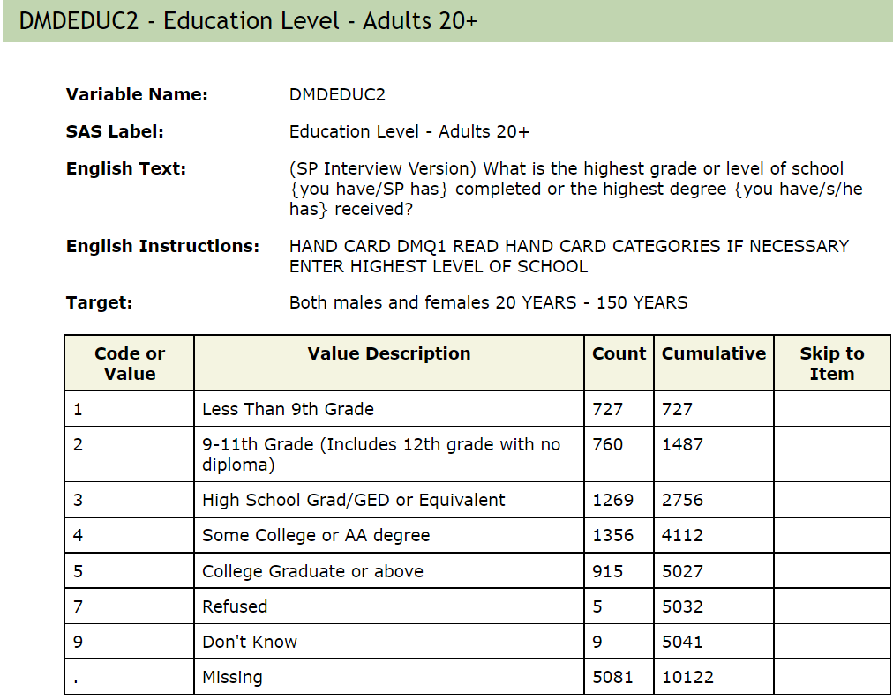
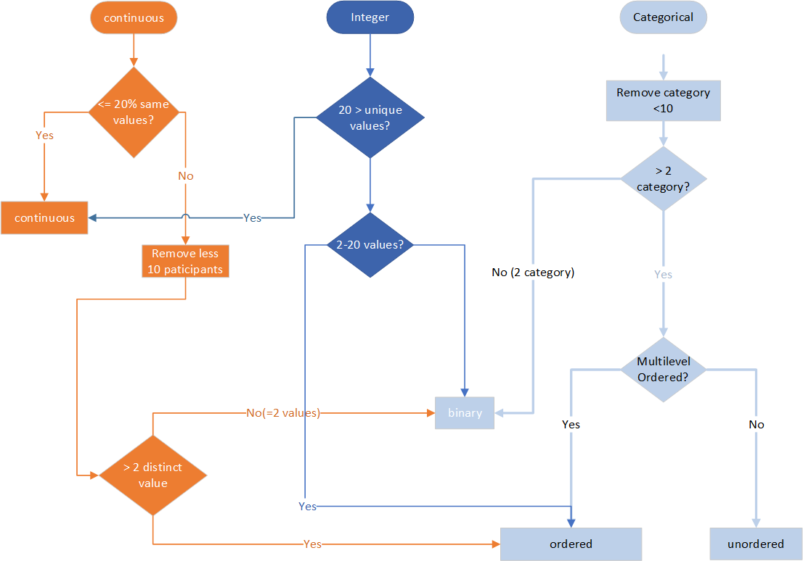

```{r, include = FALSE}
knitr::opts_chunk$set(
  collapse = TRUE,
  comment = "#>"
)
```


### Introduction


  The NHANES data set provides a large diverse set of data to study health and other sociological and epidemiological topics on the US population.  It is used very widely and the bulk of the data are publicly available.  Our goal with the Epiconductor project is to enable users access to the data using a container that contains an SQL database and R together with other software to support different analyses of the data.  We believe that this will increase access and provide a platform for reproducibility.  This document outlines some of the ways you can interact with the NHANES data while using the container and R packages [phonto](https://github.com/ccb-hms/phonto/tree/main/vignettes) and [nhanesA](https://cran.r-project.org/web/packages/nhanesA/index.html).

### NHANES 

The [National Health and Nutrition Examination Survey (NHANES)](https://www.cdc.gov/nchs/nhanes/index.htm) datasets are collected from the Centers for Disease Control and Prevention in the USA, including demographics, dietary, laboratory, examination, and questionnaire data. The five publicly available data categories are:  

  - Demographics (DEMO)
  - Dietary (DIET)
  - Examination (EXAM)
  - Laboratory (LAB)
  - Questionnaire (Q)

The abbreviated forms in parentheses may be substituted for the long form in [phonto](https://github.com/ccb-hms/phonto/tree/main/vignettes) and [nhanesA](https://cran.r-project.org/web/packages/nhanesA/index.html) commands. There is also limited access data, eg. genetics, that requires written justification and prior approval before users are granted access. We restrict our tools to the publicly available data.

The survey is carried out in two year *cycles* starting from the first cycle in 1999-2000. Within each cycle, a set of people are surveyed, however not all of the participants are surveyed across all of the components. Within each of the data categories NHANES has organized the data into Questionnaires and provides web interfaces for descriptions of the contents of each questionnaire.  We do not replicate the web interface as users can browse that information using standard tools, but we have constructed an integrated SQL database representation of much of the publicly available NHANES data.  Placing all of the data into a single database facilitates searching and extraction of relevant values, and this provides many advantages to the individual researcher, as well as to the research world at large.

Each NHANES participant is assigned a unique ID that is stored in the database as <tt>SEQN</tt>. This is used as the primary key and merging of data extracted from different tables should be based on this variable (<tt>SEQN</tt>). 
For each two-year cycle, NHANES provides a set of data, documentation and code books, organized by each of the five publicly available categories mentioned above.  Users can explore the available data at a high level by searching within cycle, category, and measure. One example is the [Body Measures](https://wwwn.cdc.gov/nchs/nhanes/2001-2002/BMX_B.htm) table which provides data from the 2001-2002 examination data. The web page provides details on the measurements and how they are recorded.
Here are two examples:  

{width=80%}
{width=80%}


There are many ways to access and utilize the NHANES data. Users familiar with SQL can connect and explore the data with database client tools such as HeidiSQL and DataGrip, or other programming languages such as R or Python either through tools that support database connections, or as we do in the [phonto package](https://github.com/ccb-hms/phonto/tree/main/vignettes), through custom built wrappers.

Others may use [web-based tools](https://www.cdc.gov/nchs/nhanes/index.htm) provided by the CDC for investigating the data and metadata. In addition there are two existing R packages called [nhanesA](https://cran.r-project.org/web/packages/nhanesA/index.html) (Endres) and [RNHANES](https://cran.r-project.org/web/packages/RNHANES/index.html) (Susman). While most of the data collected can easily be downloaded from the CDC website, accessing the data in that way can be problematic and error prone and makes sharing and reproducibility more challenging due to the lack of versioning and the potential for changes in either the data or the infrastructure over time.  By capturing all components into containers we can aid reproducibility by versioning the containers and by keeping copies of each version for subsequent use.

The [nhanesA](https://cran.r-project.org/web/packages/nhanesA/index.html) package provides a set of tools to search and download the NHANES data and metadata, making the data more accessible to user. However, one drawback is that the tool must access the NHANES website every time the user calls the R function, which leads slow getting of the data and raises errors occasionally due to network issues.  

In the spirit of producing more easily reproduced and shared analyses we have created a SQL database in a Docker (cite Docker) container that contains most of the currently available NHANES data. For our Dockerized container only public data is included.  There are some tables what were not included due to size, or availability when we downloaded the tables to create the database. 

Around that SQL database we have constructed a number of R packages and other tools that help scientists analyze the data. Since all of the code and data are under version control, anyone can obtain the same version of the data and code and produce identical results.  We have worked with the author of that package to adapt the functions in that package to work on the NHANES Docker container. But, since having the data locally provides a number of opportunities to simplify some data integration steps we also provide a suite of tools in the `phonto` package (cite phonto).


### 1. Quick check NHANES data

We can efficiently access NHANES data using `phonto` and `nhanesA` together. By simply knowing the name of the data file or table, one can very quickly and efficiently obtain basic information, e.g. column names, dimensions, etc. 

First we load up the packages we will use for this vignette.
```{r setup}
library(nhanesA)
library(phonto)
library(DT)
```

Let's take a body measure table as an example, (<tt>BMX_I</tt>).

- show column names of an NHANES table. 

```{r}
nhanesColnames("BMX_I")
```

- show number of rows/columns and dimension of an NHANES table
```{r}
nhanesNrow("BMX_I")
nhanesNcol("BMX_I")
nhanesDim("BMX_I")
```

- First/Last records of an NHANES table

```{r}
nhanesHead("BMX_I")
nhanesTail("BMX_I")
```

### 2. Searching the NHANES database


Comprehensive lists of NHANES variables are maintained for each data group. For example, the demographics variables are available at https://wwwn.cdc.gov/nchs/nhanes/search/variablelist.aspx?Component=Demographics. This section describes how to search the NHANES database.

----
  
#### 2.1 Searching for tables
  
The function `nhanesSearchTableNames` lets users search for tables in the database using the table name. For example, we can search the blood pressure related tables using the following code. We search for the string "BPX" as the parameters based on the CDC table name conventions. This also demonstrates the naming convention that is often (although not always) used by the CDC.  There is generally a base name (some short set of uppercase characters) and then a suffix, for all but the first cycle, that increases lexicographically one letter per cycle.  If you click on the next button in the table below you will see that there is one table named "BPXO_J" which is a bit different from the others. According to the documentation during the 2017-2018 cycle *a BP methodology study was conducted to compare BP measurements obtained by a physician using a mercury sphygmomanometer to those obtained by a health technician using an oscillometric device.*

```{r}
res = nhanesSearchTableNames("BPX", details=TRUE)
datatable(res)
```

We provide access to functions within the database for matching strings. In the example below the string "BPX[_]" string is passed to the database engine directly.  This string matches only tables containing the string "BPX_"; therefore, the table named "BPXO_J" will not match. We note that the table named "BPX" also has no underscore and it also will not match. Recall that in the first survey cycle the table names have no underscore or suffix.

```{r}
res = nhanesSearchTableNames("BPX[_]", details=TRUE)
datatable(res)
```

----  

#### 2.2 Searching for variables.
  
  ##FIXME: somehow we need to figure out a search strategy that puts some of the output into an HTML page, or a searchable datatable
  ##FIXME (TJFS): I am not sure what you mean by this
  ## the problem with the return values is that they are often long and fairly complex, that is not easy to go through at the R level - if we push this into a datatable and open it in the browser then they could search through that.
  ## FIXME: one way to do this is to just capture the datatable output and push it to html and open it in the browser -

#### 2.3 Searching for Variables

 One of the main challenges in using the NHANES data set is finding the tables that contain the data you want to analyze.  In this section we outline some of the basic methods you can use to do the searching. The returned value can be put into a searchable data table that you can use to further filter, sort and search for specific variables.
 
The primary purpose of the `nhanesSearch` function is to facilitate the search for specific text strings within the variable description field. By utilizing this function, users can obtain a convenient data frame that includes the names of variables whose descriptions meet the specified criteria. Furthermore, the function offers additional filtering options, such as specifying a start and stop year, enabling users to further refine their search results.


```{r}
# nhanesSearch use examples
#
# Search on the word bladder, restrict to the 2001-2008 surveys, 
# print out 50 characters of the variable description
bl = nhanesSearch("bladder", ystart=2001, ystop=2008, nchar=50)
dim(bl)
#
# Search on "urin" (will match urine, urinary, etc), from 1999-2010, return table names only
urin = nhanesSearch("urin", ignore.case=TRUE, ystop=2010, namesonly = TRUE)
length(urin)
urin[1:10]
#
```

The `nhanesSearch` function also provides an option to exclude specific matches. In the previous search, any variable name containing the word "during" would have been considered a match. However, by excluding these terms in the output, the function ensures results that more accurately reflect your desired specifications.
```{r}
urinEx = nhanesSearch("urin", exclude_terms="during", ignore.case=TRUE, ystop=2010, namesonly=TRUE)
length(urinEx)
urinEx[1:10]
```

You can also restrict the search to specific data groups (such as EXAM).
Several other types of search are shown below.

```{r}
#
# Restrict search to 'EXAM' and 'LAB' data groups. Explicitly list matching and exclude terms, leave ignore.case set to default value of FALSE. Search surveys from 2009 to present.
urinrest = nhanesSearch(c("urin", "Urin"), exclude_terms=c("During", "eaten during", "do during"), data_group=c('EXAM', 'LAB'), ystart=2009)
head(urinrest) # namesonly=TRUE by default, and it only returns an vector
#
# Search on "tooth" or "teeth", all years
teeth = nhanesSearch(c("tooth", "teeth"), ignore.case=TRUE)
head(teeth)
#
# Search for variables where the variable description begins with "Tooth"
sttooth = nhanesSearch("^Tooth")
dim(sttooth)
datatable(sttooth)
```


#### 2.4 nhanesSearchVarName

Now suppose we wanted to find variables names that contain information about (low density lipoproteins).  To do that one can first use the `nhanesSearch` function to retrieve a master list of any and all questions matching this search term in it's *Description*. One can then use the output of this search to identify variable names of interest. The variable name can then be searched for using the `nhanesSearchVarName` function.  In the code below we find a variable names corresponding to LDLs and then find all the tables that contain a variable with that name.

```{r}
s1 = nhanesSearch("LDL", nchar=256, data_group="LAB")
DT::datatable(s1)

```

Scrolling through the datatable we find that there are a number of variables that correspond to an actual LDL measurement, several are named `LBDLDL` and so we can now search for that variable.
```{r}
LDLTabs = nhanesSearchVarName('LBDLDL')
LDLTabs
```

### 3 nhanesCodebook

Information about each variable is stored in the NHANES code book. To access the NHANES code book one can use the `nhanesCodebook` function. The function returns a list of length 5 that provides pertinent information about the variable. The first four elements provide basic descriptor information, i.e. `Variable` is the variable name, `Description` is the actual text of the question (or a description of the lab value), `Target` tells you which participants were eligible to be asked and `SasLabel` is the variable label.
The 5th element, the `Codebook`, is a data frame providing information about the structure of the variable, such as which values the variable can take on. When you want to combine variables across study years you will need to be careful to ensure that the `Codebooks` are compatible.  NHANES has changed variables, added or removed possible answers, and done many other things as the questionnaires have evolved.  It is **not safe** to assume that an identical variable name will have an identical interpretation.
 
```{r}
  cb1 = nhanesCodebook(nh_table = LDLTabs[1], colname = "LBDLDL") 
  cb1
```

  The alert reader will have noticed the column labeled Cumulative.  The values in this column are provided by NHANES and can be used to check whether the data extraction you carried out aligns with their reported values.  The column labeled SkipToItem will be non-missing if there was some complex logic in how the survey was performed. In some cases a set of questions will be skipped for a subset of the participants, depending on their answer to the *current* question.  For example, if the current question was ``Have you ever been told by your doctor you have Diabetes?``, and then there say 10 follow-up questions asking about symptoms, someone who answered ``No`` would not want to answer those questions, and so the interviewer will skip over them, to the next relevant question for anyone who says ``No``. This makes for a good survey experience for the participants but it also makes the data analysis a bit messier.  The analyst will have to examine all the questions that can be skipped and assess how to deal with the values recorded.
  While we are on the subject of messy data, the `Target` information can also introduce structured missingness into your data. Some questions are only relevant to certain age groups, and in those cases the `Target` field will indicate who is going to be asked. Everyone outside of the `Target` range will have a missing value for that question.

### 4. Data manipulations

#### 4.1 unionQuery()

The `unionQuery()` function is designed to aggregate data across the years for a fixed Questionnaire. Thus we are assuming all the inputs have essentially the same columns and that all variables are measuring the same concept across years. This function then aggregates by appending rows and returns the results as a data frame. If there are columns that are unique to one (or a few) questionnaires then these will be filled in as NA in any questionnaires that don't have that column.  Currently this function does not check the code books for consistency of inputs across years; analysts will need to do that for themselves. 

For an example of how to utilize this function, we use the blood pressure tables BPX, BPX_B,...BPX_J from years 1999-2000 to 2017-2018. User can aggregate some or all of the data contained in relevant tables.  Note: we are showing this example for illustrative purposes and have not carefully checking the code book. We encourage you to take the time to always ensure that code book entries are compatible.

```{r search_union,warning=FALSE,message=FALSE}
nhanesSearchTableNames('BPX[_]')

blood_df <- unionQuery(list(BPX_C=c("BPXDI1","BPXDI2","BPXSY1","BPXSY2"),
                            BPX_D=c("BPXDI1","BPXDI2","BPXSY1","BPXSY2")))
DT::datatable(blood_df[1:400,])
```

#### 4.2 jointQuery()
The `jointQuery()` function, table list of table name and a set of column names, it merges the researched results and returns the results as a data frame. The data are joined using SEQN which is the unique identifier for individuals.

The example below is much more complex than our previous examples, but it is also a more realistic query example. We are collecting data across 4 tables, DEMO, BPQ, HDL and TRIGLY. And also across data collection cycles I and J.  We first construct our query string, note that it is important that every table appears twice, once with an **_I** and once with an **_J**. In addition the variables being selected must be the same for each cycle and each table.

```{r}
cols = list(DEMO_I=c("RIDAGEYR","RIAGENDR","RIDRETH1","DMDEDUC2"),
                     DEMO_J=c("RIDAGEYR","RIAGENDR","RIDRETH1","DMDEDUC2"),
                     BPQ_I=c('BPQ050A','BPQ020'),BPQ_J=c('BPQ050A','BPQ020'),
                     HDL_I=c("LBDHDD"),HDL_J=c("LBDHDD"), TRIGLY_I=c("LBXTR","LBDLDL"),
            TRIGLY_J=c("LBXTR","LBDLDL"))
data <- jointQuery(cols)
tdata = data[1:100,]
datatable(tdata)
```


### 5. PHESANT-like process

The NHANES project provides thousands of phenotypes and exposures. Navigating these can be very challenging and we are in the process of developing tools that will aid users in navigating the data quickly and reliably. Developing tools that can better help analysts navigate data at this scale is important.  We are patterning our efforts on those that were developed for the UK Biobank (Bycroft et al. 2018) and specifically the PHESANT (Millard et al. 2017) package.  

We can run a PHESANT-like process to convert each column into data types. It also provides the ratio of unique values (`r_unique`), the proportion of zeros (`r_zeros`), and the ratio of NAs (`r_NAs`), which is calculated by the number of unique values, zeros, and NAs divided by total records. The categorical data types (ordered or unordered) are represented by integers, and we categorize them as multilevel. For example, education (DMDEDUC2) is labeled as Multilevel(7) which means it has 7 levels. Information on whether or not the levels are ordered would have to be obtain from the on-line NHANES documentation.


```{r}
phs_dat = phesant(data)
data = phs_dat$data
DT::datatable(phs_dat$phs_res)
```

We can also find out which variables are categorical.
```{r CategoricalVars, echo=TRUE}
categoricalVars = rownames(phs_dat$phs_res)[grep("^Multilevel", phs_dat$phs_res$types)]
categoricalVars
```


### 6.Setup factor levels for categorical variables

In the raw NHANES data stored in the database all categorical variables are represented as integers.  In order to make use of these for analysis you will need to transform them into factors in R.  

Categorical variables are presented with integers as shown below.

```{r}
data[,c('RIAGENDR', 'RIDRETH1','DMDEDUC2')] |> head() |> knitr::kable()
```
And the real factor levels for year 2003-2004 can be found in [the codebook]() as shown below.
{width=85%}
{width=85%}
{width=85%}


The data from NHANES comes as tables with integer codes for each of the levels of a factor variable.  A separate file, one for each cycle and questionnaire, has the map from the codes to the text description of what the levels mean. Because the chances of errors if users have untranslated variables (e.g. treating them as integers for example) we automatically translate all of these tables.  There is a way to access the raw data that is explained in a different vignette.

The code below is how you would do the translation using the `nhanesA` package.  But in the NHANES docker container this is not needed.


```{r,DT.warn.size=FALSE, eval=FALSE}
##now we can translate the variables that need to be translated
t1 = nhanesTranslate("DEMO_J",c("RIDAGEYR","RIAGENDR","RIDRETH1","DMDEDUC2","years"),data=data)
datatable(t1[1:100,c('SEQN','RIDAGEYR','RIAGENDR', 'RIDRETH1')] )
```


Currently, we are doing as the following flow chat, but both the ordered and unordered are considered as multilevel.
{width=80%}

